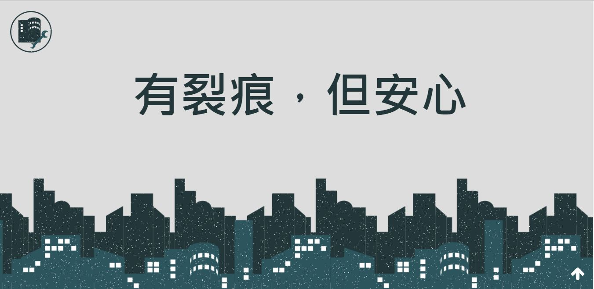

# 安居Angel－建築劣化團隊介紹(2019課程)
https://hsuan197.github.io/building/index.html

## 【組別】
D組

## 【團隊成員】
資管所陳必欣(設計師)、資工系吳宣蓉(工程師)、電機系張辰維(工程師)、電機系陳哲彥(工程師)、系統系何松軒(工程師)

## 【簡介】
家是你我的庇護所，台灣在地震帶往往對我們的家造成傷害，安居Angel因而誕生。  
透過安居聯繫民眾、志工與建築師三方，民眾即時通報、志工進一步篩選申報狀況，搶先讓建築師了解問題，回報給民眾，讓你我住得安心。  
安居Angel connect the people, volunteers, and architects to quickly resolve the deterioration of  the building and let the people of Taiwan in the earthquake zone feel at ease. 

## 【主頁截圖】

